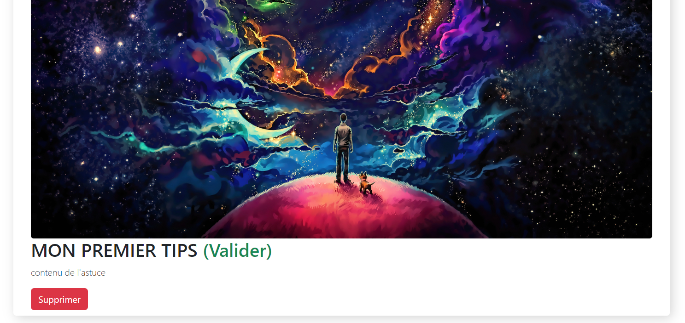

## Utilisateur non authentifié:

Vous pouvez naviguer entre les différentes pages du site qui sont réserver au personnes qui ne sont pas connecter: \\

* Accueil et le logo "Tips Sharing" : vous permet à tout moment de revenir à l'accueil.
* Tips : est la page d'affichage de toutes les astuces qui ont été validé par un administrateur.
* Login : vous permet de vous authentifiez.
* Register : vous permet de vous inscrire. \
  \- En cliquant le boutons rouge tout en haut vous pourrez préremplir vos champs en vous connectant à gmail.

  \- Si l'inscription à fonctionner, vous serez rediriger vers la page de login pour vous connectez, dans le cas contraire vous aurez un message vous indiquant l'erreur.

## Utilisateur authentifié:

Apres vous êtres authentifié, vous serez redirigez sur la page de profil, c'est la page affichant vos informations public tels que votre pseudo, vos tips valider etc.

### Barre de navigation (authentifié)

Vous remarquerez que la barre de navigation à changer. Vous avez en plus les boutons :

* Profil : qui vous permet à tout moment de vous rendre sur la page actuel (le profil de l'utilisateur).
* New Tips : vous permet de créer un Tip.
* Admin : vous permet de vous rendre sur la partie du site réserver aux administrateurs. Ce bouton n'apparaitra que si vous êtes un administrateur.
* Deconnexion : est un bouton vous permettant de vous déconnectez du site.

### Page profil et intéraction:

Sur votre profil vous avez 3 boutons:

* Profil : vous permettant d'éditer vos informations tels que : Comme indiquez, tout champs non rempli ou invalide seront ignorées. Seul les champs correctement rempli seront sauvegarder.

  Donc si vous souhaitez changer votre pseudo et votre prénom, vous remplissez les champs correspondant et les 2 autres champs ne seront pas impacter (photo de profil, nom)
* Identifiant : vous permettant d'éditer votre email et votre mot de passe.

  
* Gérer les tips vous affiches l'ensemble de vos tips valide ainsi que ceux en attente de validation\
  Vous pouvez supprimer un de vos tips (valide ou non) en appuyant sur le bouton rouge "supprimer"

  ### Page New Tip et interaction:

  

  Vous pourrez créer votre tip après avoir correctement rempli tous les champs.

  Pour ajouter un tag, il vous suffit de remplir le champ à gauche du bouton "ajouter le tag", un tip à besoin de minimum 2 tags pour pouvoir être créer.

  Apres avoir cliquer sur le bouton "Créer le tip", un message vous informeras si le tag à pus être créer ou non.

  ### Page Tips et interaction:

  Pour rappel, cette page est également disponnible en étant pas authentifié.

  La page liste l'ensemble des tips valide sur le site. Vous pouvez rechercher un tip (filtrer le contenu de la page) en utilisant le champ "faire une recherche" (Le filtre est appliqué sur le titre mais ausi sur le contenu des tips)

  En appuyant sur le bouton "voir plus" d'un tips, vous pourrez vous rendre sur le profil du tip

  ### Profil d'un tip et interaction:

  ### Utilisateur non authentifié :

  En tant qu'utilisateur non authentifié, vous ne pourrez que lire le tip, ses informations, ses commentaires etc.

  

  #### En tant qu'utilisateur authentifié connecter:

  Vous pourrez réaliser les même choses qu'un utilisateur non authentifié mais aussi commenté,

  et vous rendre sur les profils des differents utilisateur en cliquant sur leur pseudo.

  #### En tant qu'utilisateur administrateur:

  Vous pourrez réaliser les même choses qu'un utilisateur authentifié mais aussi supprimer des commentaires en appuiyant sur le bouton "supprimer".

  

  ## Utilisateur administrateur

  Sur la page d'accueil des administrateurs, vous avez 3 boutons:
*  le premier vous permez d'afficher la liste des administrateurs du site

  
* le deuxième vous permet de gérer les membres (bannir/dé bannir ou promouvoir en administrateur)

  
  * En cliquant sur le bouton rouge, vous pouvez bannir et dé bannir un membre. (Si le bouton est à true, c'est que la personne n'est pas banni, en cliquant dessus il va bannir le membre et passer à la valeur false Inversement en cliquant sur le bouton en mode false, vous dé bannissez le membre)

    En cliquant sur le bouton vert "Promouvoir" vous transformez le membre en administrateur.
* le troisième vous permet de gérer les tips en les validant ou ont les supprimons.

  
  En cliquant sur le bouton vert "Valider" le tip est valider, ce qui le rend disponnible sur tout le site (Il est accessible sur la page Tips et son profil de tip est rendu accessible à tout utilisateur, ce qui n'est pas le cas tant qu'un tip n'est pas valider).

  En cliquant sur le bouton rouge "Supprimer" vous refusez le tip et il est complètement supprimer du site.